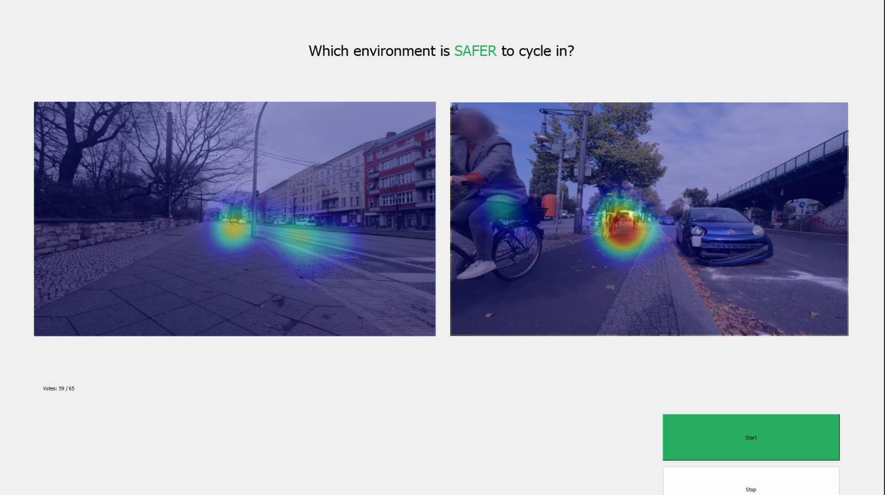

# EG-PCS Dataset

The **EG-PCS dataset** is a research collection for perceived cycling safety. It contains pairwise street-view image comparisons, perceived-safety labels, and fixation-based gaze maps collected from eye-tracking experiments. The underlying survey was approved by Instituto Superior Técnico’s Ethics Committee and captured perceived cycling accident safety in different environments using pairwise image comparisons.

Dataset DOI: https://doi.org/10.5281/zenodo.20101496

## Dataset Formation

The dataset was formed from 249 survey responses, including 26 surveys collected with eye-tracking technology. Participants evaluated perceived cycling accident safety across different street-view environments using pairwise image comparisons. The eye-tracking subset provides fixation-derived gaze annotations for a subset of the comparisons.

  

The example above shows one eye-tracking trial used as part of the dataset foundation, with gaze maps overlaid on the two compared street-view images.

## Dataset Composition

| Dataset subset | y=-1 | y=0 | y=1 | Total | Gaze subset |
| --- | ---: | ---: | ---: | ---: | ---: |
| Barcelona | 389 | 334 | 430 | 1,153 | -- |
| Berlin | 2,905 | 1,363 | 3,002 | 7,270 | 999 |
| London UK Collideoscope | 204 | 171 | 184 | 559 | -- |
| London UK Gov | 184 | 184 | 191 | 559 | -- |
| Munich | 198 | 107 | 228 | 533 | -- |
| Paris | 176 | 179 | 194 | 549 | -- |
| Sequences | 627 | 1,487 | 886 | 3,000 | 420 |
| **Total** | **4,683** | **3,825** | **5,115** | **13,623** | **1,419** |

Labels indicate the perceived safer image in each pair: `y=-1` means the left image was perceived as safer, `y=0` indicates a tie, and `y=1` means the right image was perceived as safer.

## Contents

- Pairwise comparison labels for street-view image pairs.
- Street-view image references used in the comparisons.
- Derived gaze maps representing participant visual attention during the task.
- Column-level documentation in `data_dictionary.csv`.
- Dataset card in `dataset_card.md`.
- License notice in `DATA_LICENSE.txt`.

## Research Use

The dataset supports research on perceived cycling safety, pairwise visual ranking, gaze-guided learning, attention alignment, and interpretable urban analytics.
